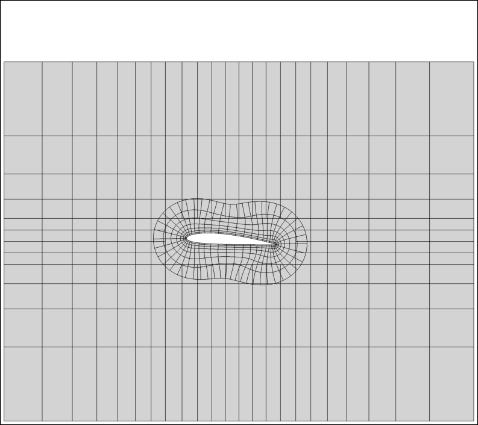
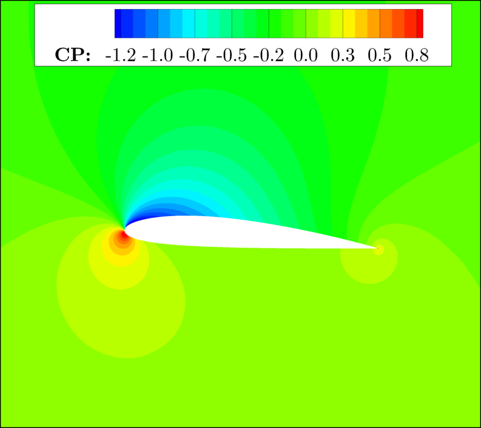
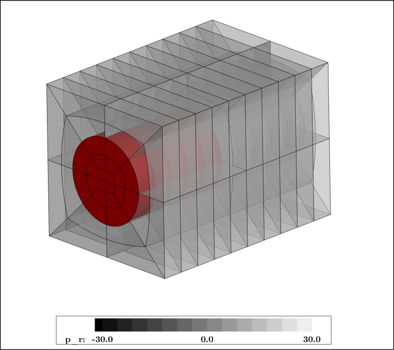
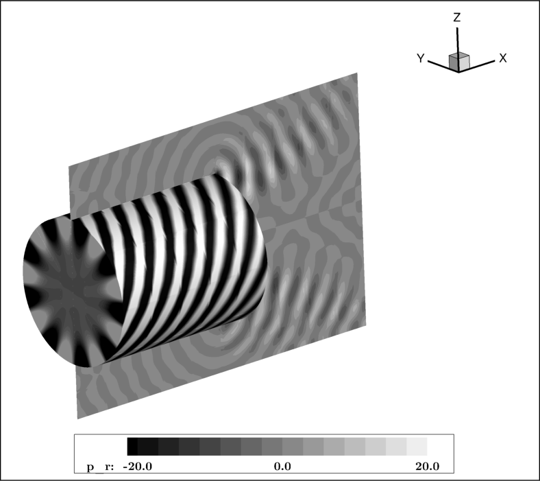
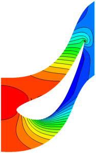
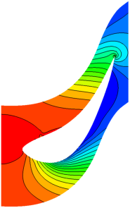

    

# ChiDG

[![][license img]][license]

A Chimera-based, discontinuous Galerkin solver

Overset airfoil grid                              |  NACA 2412 pressure
:------------------------------------------------:|:------------------------------------------------------:
  |     

4th-order duct grid                               |  Acoustic duct mode radiation. 7th-order accuracy.
:------------------------------------------------:|:------------------------------------------------------:
               |       

Constant pressure outlet boundary condition       |  Fully-implicit nonreflecting outlet boundary condition
:------------------------------------------------:|:-------------------------------------------------------:
 |   

## Documentation

Documentation can be found on the following github page:

[ChiDG Documentation](https://nwukie.github.io/ChiDG/ )

## Installation

### Dependencies

CMake: Build system  
HDF5: File IO
BLAS/LAPACK: Optimized linear algebra
METIS: Domain-decomposition
MPI: Parallelization

[Instructions for building ChiDG](http://nwukie.github.io/ChiDG/getting_started/getting_started.html#build-from-source )

## License
ChiDG is released under the BSD 3-clause license. See LICENSE file.

## Author Acknowledgement:
Nathan A. Wukie   <nwukie@gmail.com>

## Sponsorship Acknowledgement:
This material is based upon work supported by the National Science Foundation Graduate 
Research Fellowship Program under Grant No. 1610397. Any opinions, findings, and 
conclusions or recommendations expressed in this material are those of the author(s) 
and do not necessarily reflect the views of the National Science Foundation.

[license]:LICENSE
[license img]:https://img.shields.io/badge/license-BSD%203--clause-blue.svg

